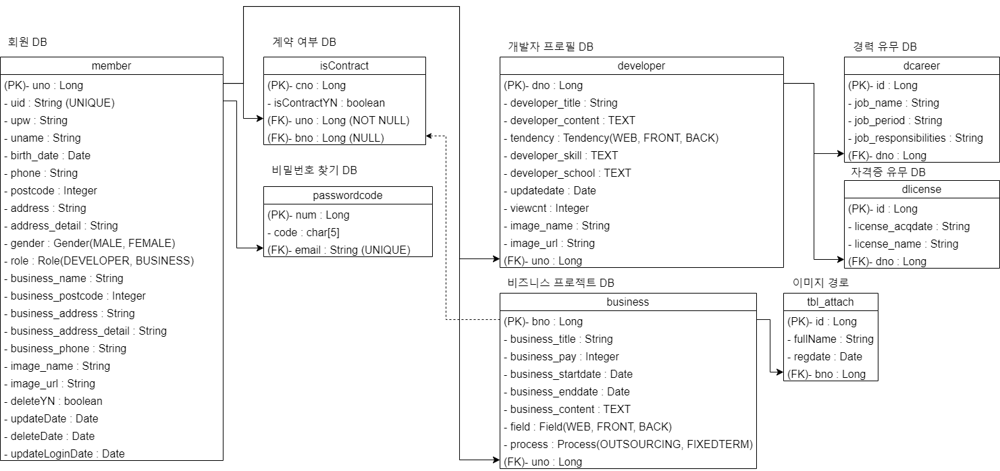
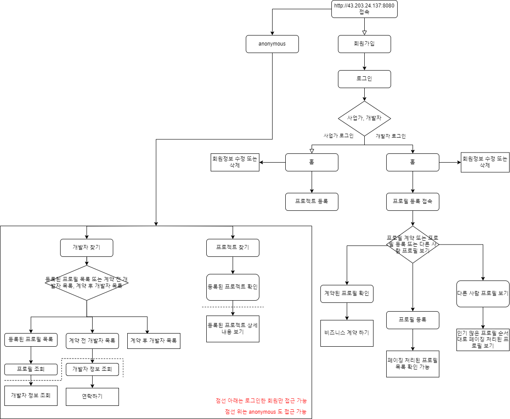

# 발생하는 오류 (V2에서 수정 예정)
```
> 회원가입 시, interceptor에서 처리하는 권한 관련된 메시지들을 response로 전달 받는 한글 UTF-8 적용 안되고 있음 (문제 원인을 찾는게 제일 시급)

> 프로젝트 등록 페이지 validation 코드를 짜지 않아서 입력되는 값이 없을 때 500 에러 발생

> 로그인 할 시 잘못된 계정 정보로 로그인하면 서버에 에러 메시지가 뜨고 있던데 확인이 필요(서버가 가동하는 데는 문제 없음)

> 프론트 작업(개발자 등록 시 다른 사람 프로필 보기에서 2페이지를 클릭하면 페이지가 리로드 되면서 등록된 프로필 보기로 이동하게 됨 여기서 다른 사람 프로필 보기 누르면 페이징 처리가 잘 되고 있는 것을 확인 가능)

> Route53 ssl/tls 적용 문제 --> 노션 페이지 참고 (https://tremendous-crocus-4a0.notion.site/Route53-55f0a8e8bc5c4f38a5f3993100dc88cc?pvs=4)
```

# 후에 추가될 업데이트 버전 (V2)
```
> S3에 저장되고 있는 폴더 경로가 지정되어 있지 않아 찾기가 번잡 (저장 시 폴더 경로 지정)

> 서버에 저장되고 있는 프로젝트 등록 파일 또는 이미지를 S3로 옮기도록 조정 예정

> 프로젝트 수정과 삭제 구현

> 프로젝트 찾기 구현
```

# 후에 추가될 업데이트 버전 (V3)
```
> 좀 더 세련된 디자인으로 홈페이지 구성

> 프로젝트 등록 후 계약 체결 로직 구현 예정
```

# DB 다이어그램


# 피그마 페이지
<a href="https://www.figma.com/file/T7KEgv4NuViS8cwPf4S3L3/PEOPLE.DRIVER?type=design&node-id=0%3A1&mode=design&t=3vQVC9808Ltxab2s-1">피그마 페이지 링크</a>

# 웹 사이트 로직 흐름


# 실행 영상
<a href="https://youtu.be/vMHdKvY89Lk"> S3에 업로드 하는 영상 </a> <br/>
<a href="https://youtu.be/vMHdKvY89Lk"> 에러 404, 405 처리 페이지 </a> <br/>
<a href="https://youtu.be/vMHdKvY89Lk"> 권한 관련된 영상 (간단 축약) </a> <br/>
<a href="https://youtu.be/vMHdKvY89Lk"> 전체 시연 영상 </a> <br/>

# 간단한 소개
개발자로의　ｒｏａｄ를　걷는　길에　프리랜서는　무엇을　하는　걸까？라는　질문에서　시작하여，　우리는　개발자들이　많은　참여　기회와　소통의　폭을　넓힐　수　있는　플랫폼을　만들고자　하였습니다．　이　플랫폼을　통해　개발자들은　마음껏　다양한　프로젝트를　경험하고，　편안하게　업무를　수행할　수　있는　환경을　제공받을　것을　목표로　합니다．


# 발표 ppt와 발표 자료 및 포트폴리오 자료
추가 예정 - - - -


<br/><br/><br/><br/><br/><br/><br/><br/><br/><br/><br/><br/><br/>


# Docker

## 가상화와 컨테이너

### 명령어

- docker image ls (도커 이미지 검색)

- docker image pull [mysql:latest] (도커 이미지 가져오기) (현재는 mysql)

- docker container ls (실행중이거나 실행중지된 컨테이너 검색)

- docker run --name=[이름] -d -p 8080:8080 nginx:latest (nginx 실행 8080포트로) (-d 옵션은 여러개 포트) (-p 옵션은 현재 로컬 포트) (이미지 기반의 컨테이너 생성)
    - docker run --name=[] -d -p 8080:8080 [내 계정의 Dockerhub-ID/name:TAG(v1)]
    - docker run --name=[] -d -p 8080:8080 [내 계정의 Dockerhub-ID/name:TAG(v2)]

- docker image rm [IMAGE:TAG] (이미지 삭제)

- docker container rm [name] (컨테이너 삭제)
    - 실행중인 컨테이너 삭제
        - docker container stop [name] (컨테이너 중지)
        - 중지된 거 확인 docker container ls -a
        - 중지 후 rm

- docker build -t [내 계정의 Dockerhub-ID/name:TAG] . (도커 이미지 빌드) (.은 해당 경로에 존재하는 DockerFile을 의미)

- docker push [내 계정의 Dockerhub-ID/name:TAG] (도커 이미지 내 dockerhub에 업로드)
    - 만약 push가 안된다면 권한 문제일 가능성이 큼
        - docker login (도커 로그인)
            - Username: []
            - Password: []

# 배포
- maven으로 war 빌드 파일 생성
- DockerFile과 war 파일 위치 같게 설정해서
    1. Docker build (로컬 윈도우)
    2. Docker push (로컬 윈도우)
    3. aws ec2에서 docker image pull (로컬 리눅스)
    4. aws ec2에서 docker run

- 참고
```
build file은 project.war로 설정하고
docker 디렉토리에서 server.xml 설정 추가
- <Context docBase="project" path="/" reloadable="true" source="org.eclipse.jst.jee.server:project"/>
```

- 지금은 이렇게 작업하지만 후에는 쿠버네티스 사용해서 작업하는 것도 테스트 해볼 예정

# 실행
1. AWS EC2 생성 후 Docker 설치
2. Dockerhub에서 이미지를 받아와서
3. 컨테이너로 실행